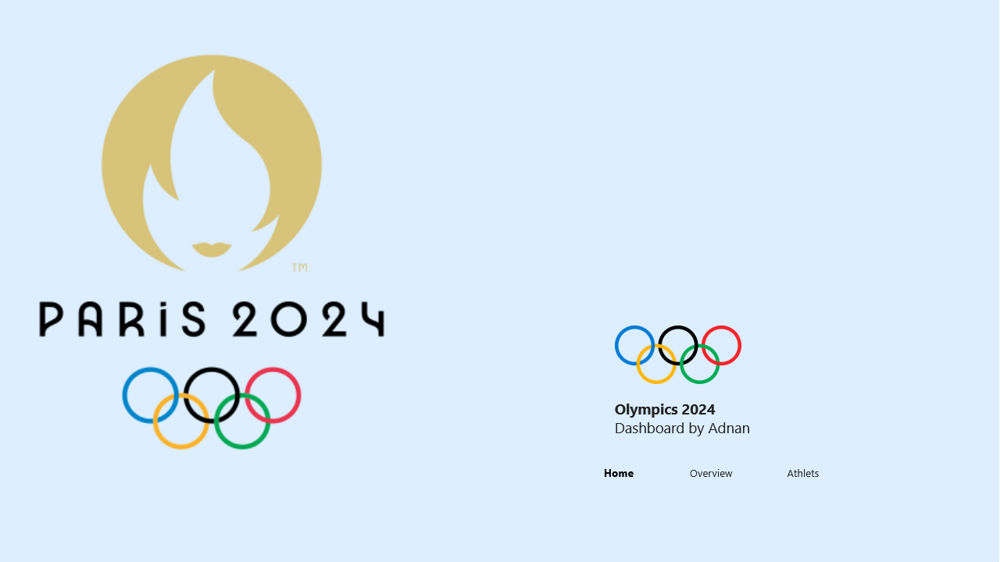
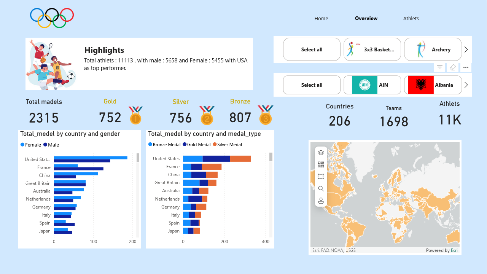
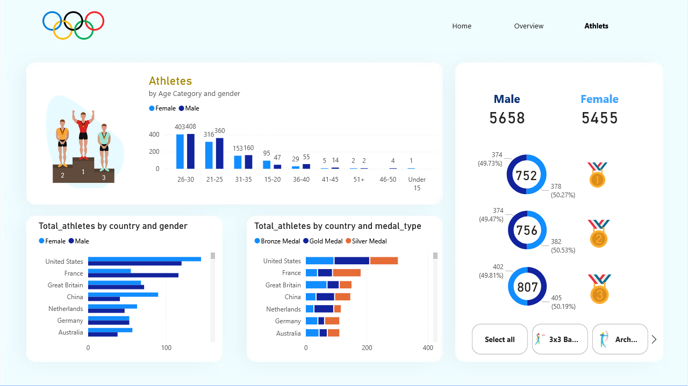
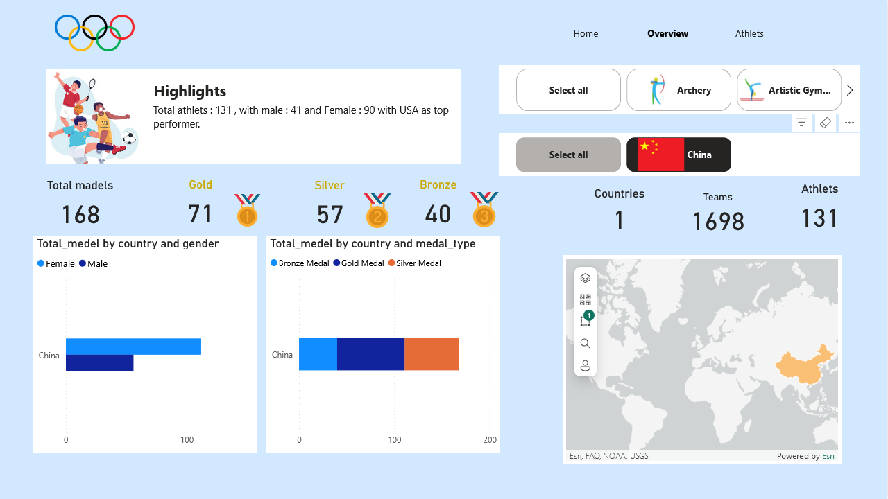
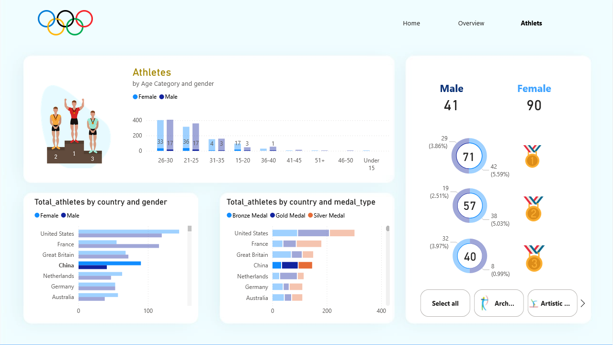

# Olympics 2024 Power BI Dashboard

A intractive Power BI dashboard that visualizes the Olympics 2024 dataset. This dashboard provides a comprehensive overview of athletes, medal statistics, and country-specific data through a user-friendly interface. It includes three main pages: **Home**, **Overview**, and **Athletes**.

## Dataset
The data used for this project can be found on Kaggle: [Paris 2024 Olympic Summer Games Dataset](https://www.kaggle.com/datasets/piterfm/paris-2024-olympic-summer-games).

## Project Structure

### 1. Home Page
The **Home Page** serves as the entry point, featuring the Paris 2024 Olympics logo and navigation options for the different dashboard sections.

### 2. Overview Page
The **Overview Page** provides a summary of the Olympic Games, including:
- **Total Medals**: Counts of Gold, Silver, and Bronze medals awarded.
- **Total Medals by Country and Gender**: A bar chart breaking down medal counts by country and gender.
- **Total Medals by Country and Medal Type**: A stacked bar chart displaying medal types won by each country.
- **Countries, Teams, and Athletes**: Key metrics summarizing the participating countries, teams, and total athlete count.
- **World Map**: A map showing the participating countries for easy geographic reference.

### 3. Athletes Page
The **Athletes Page** provides insights into the athletes participating in the Olympics:
- **Athletes by Age Category and Gender**: A bar chart showing the age distribution of athletes by gender.
- **Total Athletes by Country and Gender**: A bar chart displaying the number of athletes per country, broken down by gender.
- **Total Athletes by Country and Medal Type**: A chart showcasing the number of medals won by each country and gender.

## Key Features
- **Interactive Visualizations**: Clickable filters allow users to filter data by sport, country, and gender.
- **Data Insights**: Comprehensive visuals that highlight trends and insights for quick understanding.
- **User-Friendly Interface**: Simple navigation and layout make it easy to explore and understand Olympic data.

## Usage
To view the Power BI dashboard, follow these steps:
1. Clone the repository.
2. Open the Power BI file (.pbix) in Power BI Desktop.
3. Navigate through the Home, Overview, and Athletes pages to explore the Olympic dataset.

## PowerPoint Presentation
To view the PowerPoint presentation, click the link below:
[Olympics 2024 Dashboard Presentation](your_live_ppt_link_here)

## Screenshots
### Overview Page example on china

### Athletes Page example

